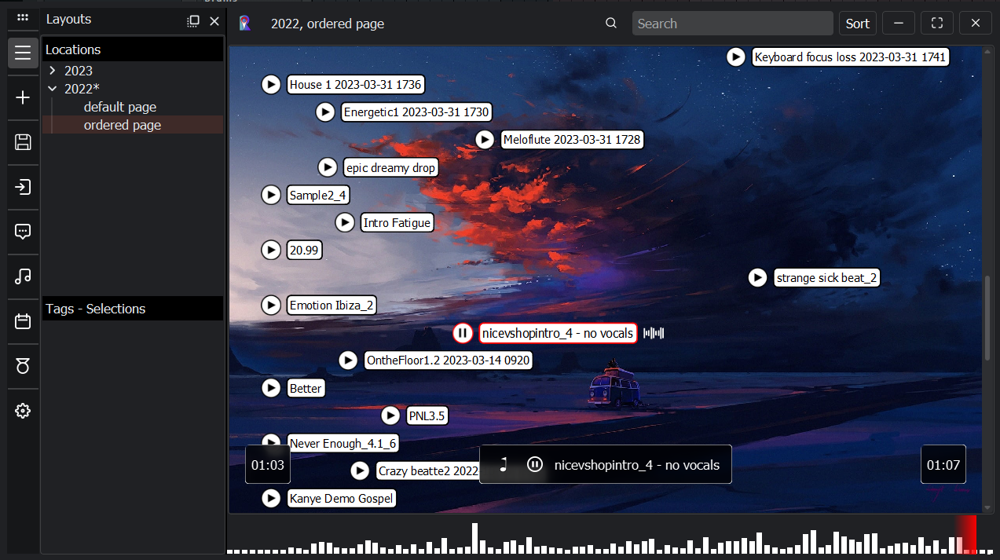
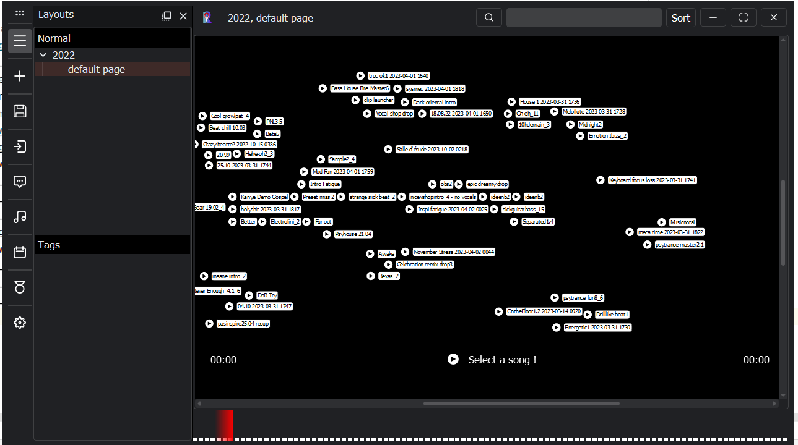

# Rendermap 🎶✨

A personal project exploring a new way to organize and navigate music ideas.  
Inspired by tools like Obsidian, it provides a 2D visual map of audio exports from DAWs (Digital Audio Workstations) for inspiration and quick access.

---

## 🚀 Features
- Auto-detects DAW export files based on keywords (e.g., "render")  
- 2D viewport to navigate and connect music ideas visually  
- Optional chronological view to quickly track the evolution of projects  
- Add comments and metadata to each idea for better organization
- 
---

## 🛠 Tech Stack
- Python  
- PyQt / PySide  
- SQLite  

---

## 📸 Screenshots

---

## 📌 Status
Developed as a year-long R&D prototype project.  
Currently private and not open-source.  
